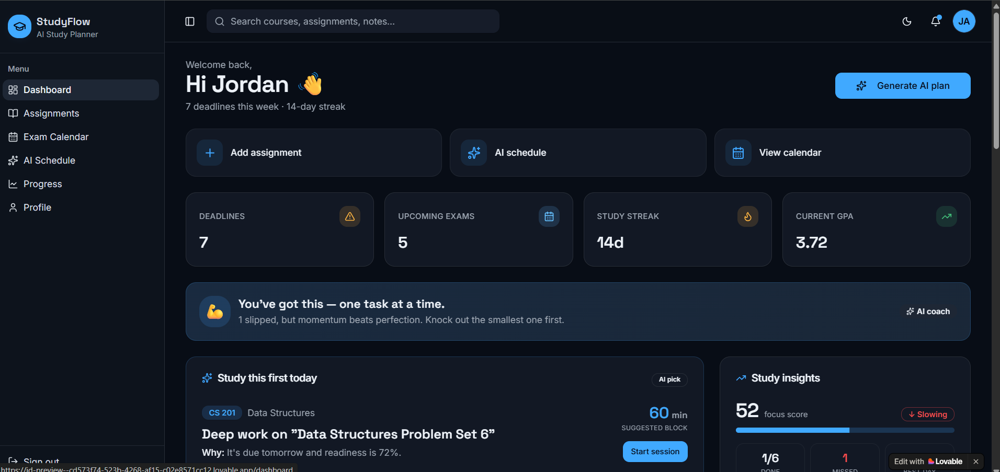
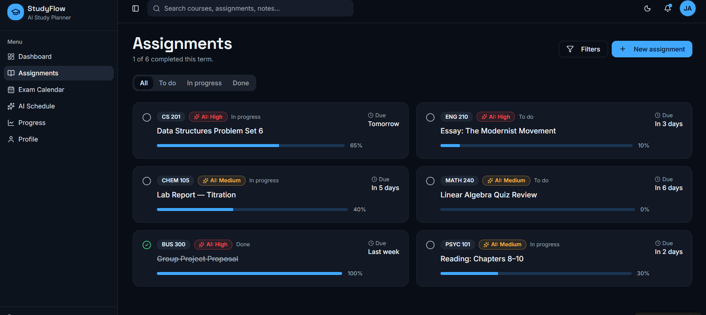
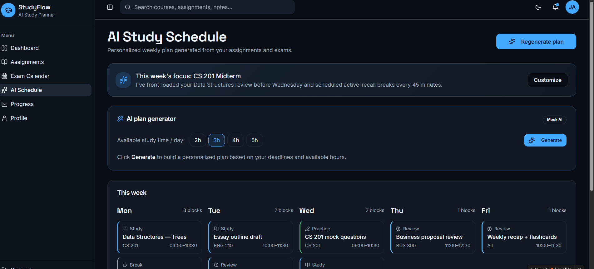
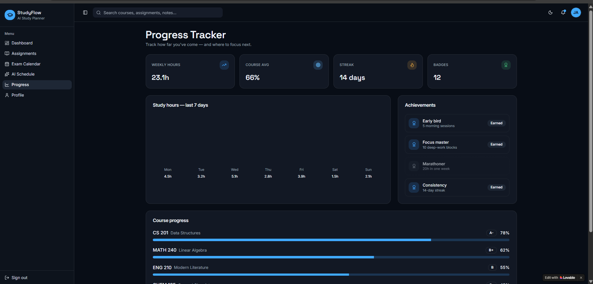
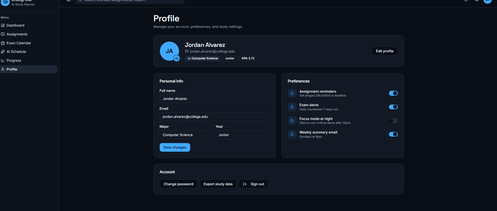

# AI Study Planner

## Project Overview

AI Study Planner is a modern web application prototype designed to help students organize assignments, exams, and study schedules using AI-powered recommendations. The application focuses on improving productivity through personalized study planning and progress tracking.

---

## Problem Statement

Students often struggle to manage assignments, exams, and study schedules effectively. Traditional calendar applications lack intelligent planning and personalized recommendations, making it difficult to maintain consistent study habits.

---

## Solution

The AI Study Planner generates personalized study schedules, prioritizes tasks based on urgency, tracks weekly study hours, and provides AI-powered productivity recommendations through an intuitive dashboard.

---

## Key Features

- AI Study Schedule Generator
- Smart Task Prioritization
- Assignment Management
- Exam Calendar
- Weekly Study Hours Dashboard
- Progress Tracking
- Upcoming Deadlines
- Dark Mode
- Responsive Design
- AI Productivity Tips

---

## Tech Stack

- Lovable
- Claude AI
- HTML
- CSS
- JavaScript

---

## Screenshots

### Dashboard

### Assignment Manager

### Study Planner

### Progress Tracker

### Profile

## Live Prototype

Paste your Lovable link here.

Example:

https://your-project-name.lovable.app

---

## Future Enhancements

- AI chatbot for study guidance
- Google Calendar integration
- Voice reminders
- Pomodoro timer
- Collaborative study groups
- Backend database
- Authentication
- Push notifications

---

## Author

Your Name
